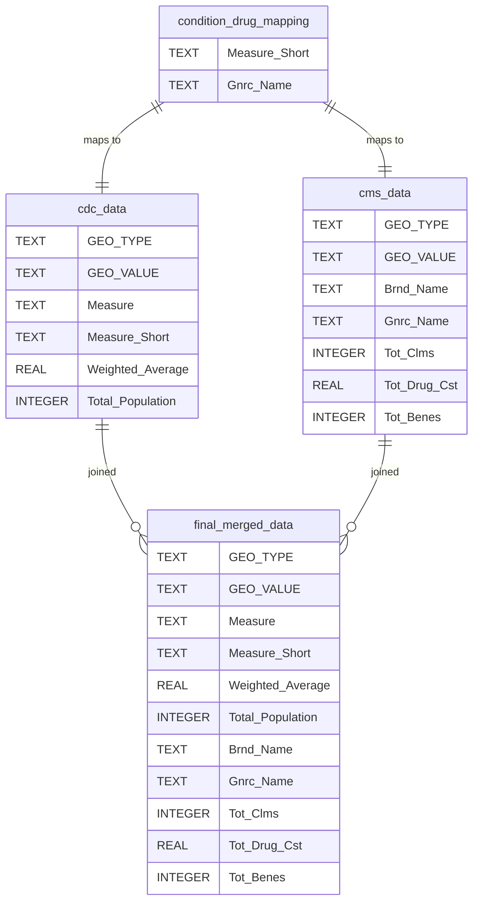

# Entity-Relationship Diagram (ERD)

## Overview

This document describes the relationships between the various data sources (CDC data, CMS data) and how they are transformed into the final table `final_merged_data`.

---

## Entities and Relationships

### 1. **CDC Data (`cdc_data`)**
   - **Columns**:
     - `GEO_TYPE`: Type of geographic region (e.g., State, County).
     - `GEO_VALUE`: Specific geographic region (e.g., state name, county name).
     - `Measure`: Full name of the chronic condition (e.g., "Diabetes").
     - `Measure_Short`: Shorthand version of the chronic condition name (e.g., "Diabetes").
     - `Weighted_Average`: Weighted average of the measure across the geographic region.
     - `Total_Population`: Total population in the geographic region.

   - **Relationships**:
     - **Joins with**: CMS Data on `GEO_TYPE`, `GEO_VALUE`, and `Measure_Short`.

### 2. **CMS Data (`cms_data`)**
   - **Columns**:
     - `GEO_TYPE`: Type of geographic region (e.g., State, County).
     - `GEO_VALUE`: Specific geographic region (e.g., state name, county name).
     - `Brnd_Name`: Brand name of the prescribed drug.
     - `Gnrc_Name`: Generic name of the prescribed drug.
     - `Tot_Clms`: Total number of claims for the drug.
     - `Tot_Drug_Cst`: Total cost associated with the drug claims.
     - `Tot_Benes`: Total number of beneficiaries receiving the drug.

   - **Relationships**:
     - **Joins with**: CDC Data on `GEO_TYPE`, `GEO_VALUE`, and `Measure_Short` (via a mapping of `Measure_Short` to `Gnrc_Name`).

### 3. **Mapping Table (`condition_drug_mapping`)**
   - **Columns**:
     - `Measure_Short`: Shorthand version of the chronic condition name.
     - `Gnrc_Name`: Generic name of the prescribed drug.

   - **Purpose**:
     - **Maps**: Chronic conditions from CDC Data to the corresponding drugs in CMS Data.

### 4. **Final Merged Table (`final_merged_data`)**
   - **Columns**:
     - `GEO_TYPE`: Type of geographic region (e.g., State, County).
     - `GEO_VALUE`: Specific geographic region (e.g., state name, county name).
     - `Measure`: Full name of the chronic condition.
     - `Measure_Short`: Shorthand version of the chronic condition name.
     - `Weighted_Average`: Weighted average of the measure across the geographic region.
     - `Total_Population`: Total population in the geographic region.
     - `Brnd_Name`: Brand name of the prescribed drug.
     - `Gnrc_Name`: Generic name of the prescribed drug.
     - `Tot_Clms`: Total number of claims for the drug.
     - `Tot_Drug_Cst`: Total cost associated with the drug claims.
     - `Tot_Benes`: Total number of beneficiaries receiving the drug.

---

## Diagram

#### Explanation

- cdc_data: Represents the CDC chronic condition data.
- cms_data: Represents the CMS prescription drug data.
- condition_drug_mapping: Serves as a mapping table connecting conditions to drugs.
- final_merged_data: The final table where all relevant data is merged and transformed.

---

**This ERD describes the flow from source data (CDC and CMS) through the transformation process (mapping) to the final merged data table.**